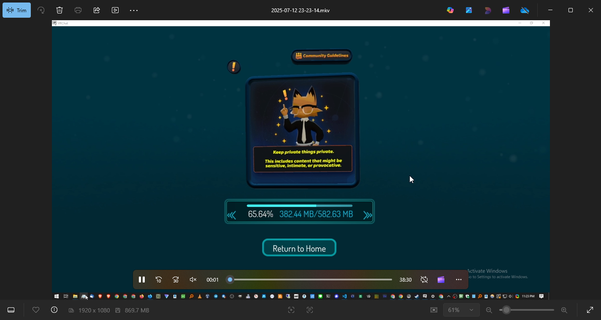
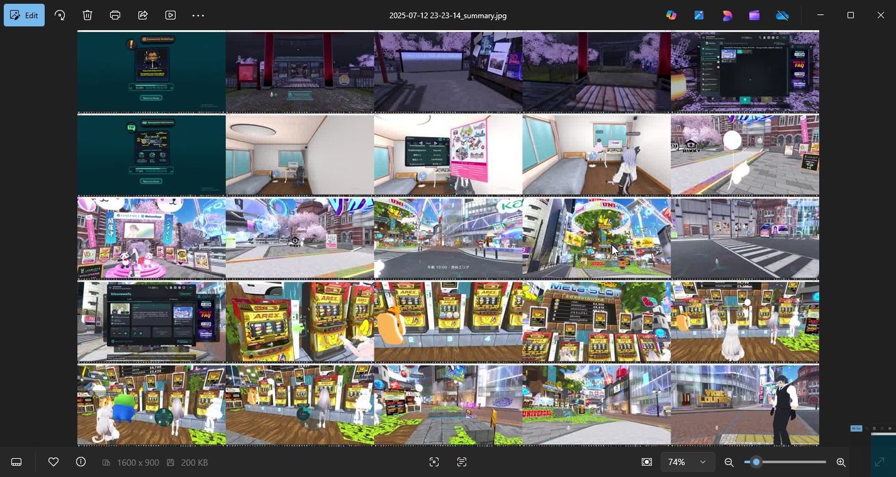
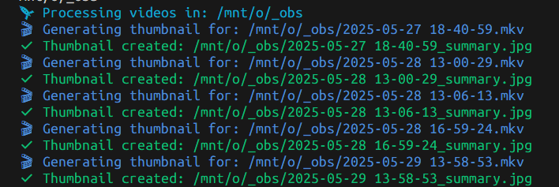

# Video Thumbnail Generator

A command-line tool that automatically generates thumbnail montages from video files to help you quickly identify and browse your video collection.


*Source video*


*Generated 5x5 thumbnail montage*

## Features

- **Recursive processing** - Scans directories and subdirectories automatically
- **Smart sampling** - Extracts frames from the first 12.5 minutes at configurable intervals
- **Multiple formats** - Supports MP4 and MKV files
- **Skip existing** - Won't regenerate existing thumbnails (safe to re-run)
- **Configurable layout** - Customizable grid sizes (5x5, 4x4, 6x3, etc.)
- **Colorful output** - Easy-to-read progress with colors and emojis
- **Fast installation** - One-line install via curl

## Quick Install

```bash
curl -fsSL https://raw.githubusercontent.com/yuis-ice/videos-to-tomontage-thumbnails/main/install.sh | bash
```

This will:
- Check dependencies (Node.js, npm, ffmpeg)
- Download and build the tool
- Install to `~/.local/bin`
- Make it available as `samples-thumbnail-generator` command

## Usage

### Basic usage
```bash
samples-thumbnail-generator
```
Processes videos in the default directory (`/mnt/o/_obs/_test`) with 30-second intervals and 5x5 grid.

### Custom directory
```bash
samples-thumbnail-generator -d /path/to/your/videos
```

### Verbose output
```bash
samples-thumbnail-generator --verbose -d ~/Videos
```

### Custom settings
```bash
samples-thumbnail-generator \
  --videos-dir ~/Movies \
  --montage-interval-seconds 15 \
  --tile 4x4 \
  --verbose
```


*Colorful CLI output with progress indicators*

## Command Line Options

| Option | Description | Default |
|--------|-------------|---------|
| `-h, --help` | Show help message with examples | |
| `-V, --version` | Show version number | |
| `-v, --verbose` | Show detailed output including ffmpeg commands | `false` |
| `-d, --videos-dir <path>` | Directory containing videos to process | `/mnt/o/_obs/_test` |
| `--montage-interval-seconds <number>` | Interval between sampled frames | `30` |
| `--tile <string>` | Grid layout (e.g., 5x5, 4x4, 6x3) | `5x5` |

## How It Works

1. **Scans recursively** for `.mp4` and `.mkv` files
2. **Samples frames** from the first 12.5 minutes at specified intervals
3. **Creates thumbnail grid** using ffmpeg's tile filter
4. **Saves as `{filename}_summary.jpg`** in the same directory as the video
5. **Skips existing thumbnails** to avoid duplicate work

## Requirements

- **Node.js** (v14 or higher)
- **npm** (comes with Node.js)
- **ffmpeg** (must be in PATH)
- **Git** (for installation)

### Installing ffmpeg

**Ubuntu/Debian:**
```bash
sudo apt install ffmpeg
```

**macOS:**
```bash
brew install ffmpeg
```

**Windows:**
Download from [ffmpeg.org](https://ffmpeg.org/download.html) or use chocolatey:
```bash
choco install ffmpeg
```

## Examples

### Gaming content
Perfect for browsing recorded gameplay sessions, streams, or tutorials.

### Educational videos
Quickly identify different topics or sections in lecture recordings.

### Security footage
Generate visual summaries of surveillance videos for quick review.

### Content creation
Preview raw footage before editing to find the best clips.

## Manual Installation

If you prefer not to use the install script:

```bash
git clone https://github.com/yuis-ice/videos-to-tomontage-thumbnails.git
cd videos-to-tomontage-thumbnails
npm install
npx tsc src/samples-thumbnail-generator.ts --target es2020 --module commonjs --outDir dist --lib es2020 --moduleResolution node
node dist/samples-thumbnail-generator.js --help
```

## Contributing

Issues and pull requests welcome! Please see the [GitHub repository](https://github.com/yuis-ice/videos-to-tomontage-thumbnails) for more information.

## License

MIT License - see LICENSE file for details.